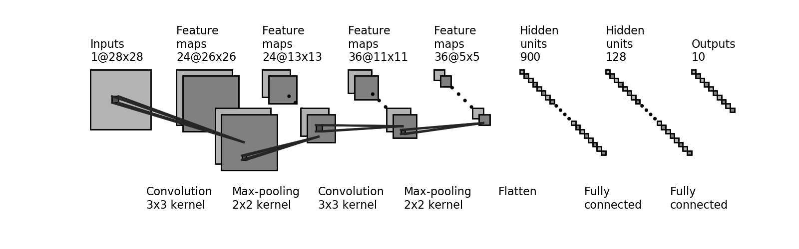

# Projeto de Classificação de Dígitos com Rede Neural Convolucional

Este projeto utiliza uma Rede Neural Convolucional (CNN) para identificar dígitos manuscritos a partir do famoso conjunto de dados MNIST. O objetivo é treinar um modelo que possa classificar imagens de dígitos de 0 a 9 com alta precisão.

## Índice

1. [Instalação](#tecnologias-utilizadas)
2. [Soluções e Resultados](#soluções-e-resultados)
3. [Referências](#referências)

## Instalação

**Requisitos**: [Jupyter Notebook](https://jupyter.org/install) ou Python 3.x

1. **Clone o repositório:**
    ```bash
    git clone https://github.com/seu_usuario/nome_do_projeto.git
    cd nome_do_projeto
    ```
### Execução via Jupyter Notebook
2. **Execute o notebook:**
    ```bash
    jupyter notebook cnn-mnist.ipynb
    ```
### Execução local
2. **Instale as dependências:**
    ```bash
    pip install -r requirements.txt
    ```
3. **Execute o código:**
    ```bash
    python3 cnn-mnist.py
    ```
## Soluções e Resultados

O modelo implementa duas camadas de convolução e de pooling. A primeira obtém 24 features da imagem aplicando um filtro de 3 por 3, e então aplica um pooling 2 por 2. A segunda camada obtém 36 features, com filtros e pooling iguais à camada anterior. Os dados então são achatados em uma camada densa de 128 neurônios, e então calcula-se as previsões através de um softmax.

A estrutura é a seguinte:


Os resultados do modelo podem ser visualizados após o treinamento. O modelo alcançõu uma precisão superior a 99% no conjundo de validação.

## Referências

Baseado no segundo Lab do curso do MIT "Introduction to Deep Learning"

[Repositório do exercício](https://github.com/aamini/introtodeeplearning/tree/master/lab2)

[Documentação do TensorFlow](https://www.tensorflow.org/api_docs/python/tf/keras)

© MIT Introduction to Deep Learning
http://introtodeeplearning.com
